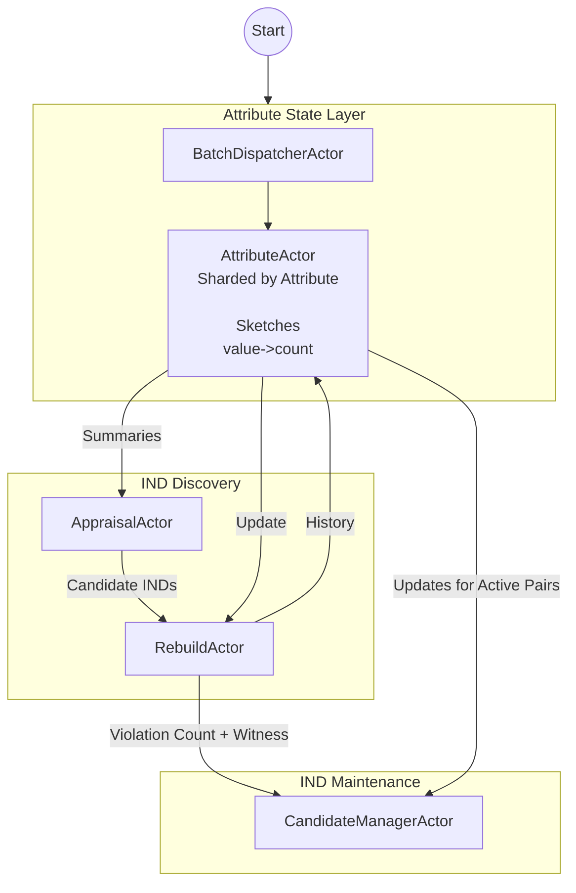

```mermaid


flowchart TB

    Start((Start)) --> DataPlane
    subgraph DataPlane["Attribute State Layer"]
        
        BD["BatchDispatcherActor"]
        ATTR["AttributeActor<br/>Sharded by Attribute<br/><br/>Sketches<br/>value->count"]
    end

    subgraph DiscoveryPlane["IND Discovery"]
        AA["AppraisalActor"]
        RA["RebuildActor"]
    end

    subgraph MaintenancePlane["IND Maintenance"]
        CM["CandidateManagerActor"]
    end

    BD --> ATTR

    ATTR -->|Summaries| AA

    AA -->|Candidate INDs| RA

    ATTR -->|Update| RA
    
    RA -->| History| ATTR

    RA -->|Violation Count + Witness| CM

    ATTR -->|Updates for Active Pairs| CM
```