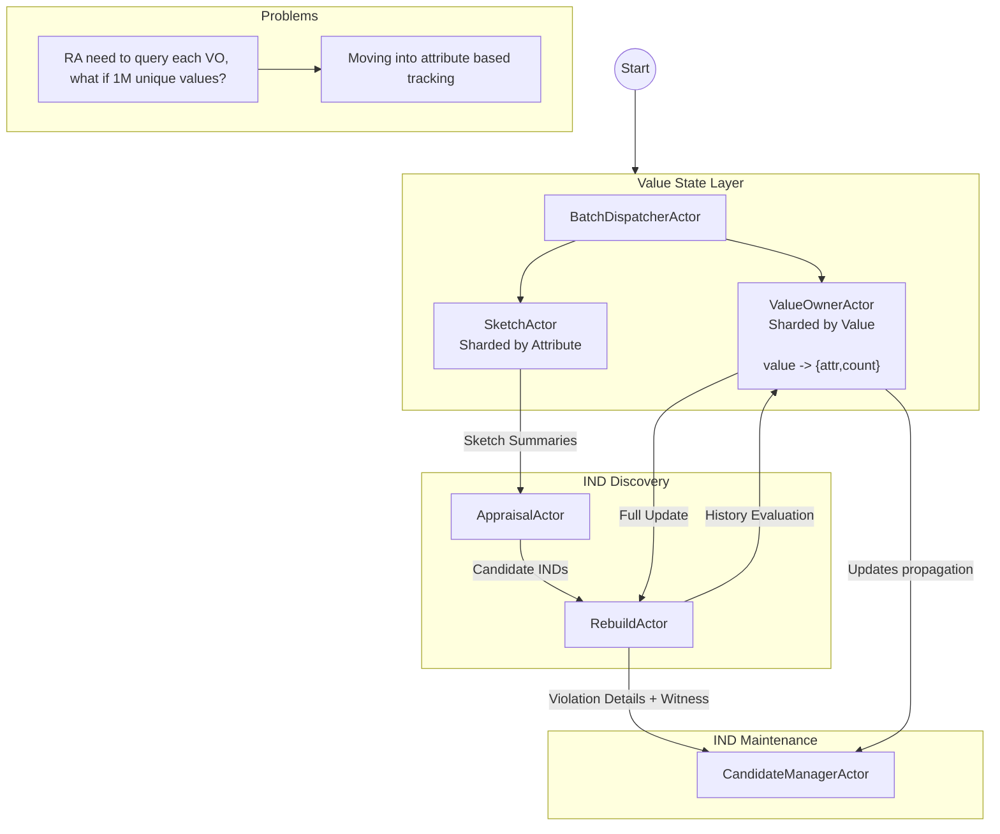

```mermaid
flowchart TB
    subgraph Problems["Problems "]
        Problem1["RA need to query each VO, what if 1M unique values?"]
        Problem2["Moving into attribute based tracking"]
        Problem1 --> Problem2
    end
    Start((Start)) --> DataPlane
    subgraph DataPlane["Value State Layer "]
        BD["BatchDispatcherActor"]
        VO["ValueOwnerActor<br/>Sharded by Value<br/><br/>value -> {attr,count}"]
        SA["SketchActor<br/>Sharded by Attribute"]
    end

    subgraph DiscoveryPlane["IND Discovery"]
        AA["AppraisalActor"]
        RA["RebuildActor"]
    end

    subgraph MaintenancePlane["IND Maintenance"]
        CM["CandidateManagerActor"]
    end

    BD --> VO
    BD --> SA

    SA -->|Sketch Summaries| AA

    AA -->|Candidate INDs| RA

    RA -->|History Evaluation| VO

    VO -->|Full Update| RA

    RA -->|Violation Details + Witness| CM

    VO -->|Updates propagation | CM
```