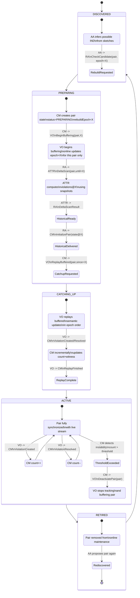

```mermaid
stateDiagram-v2

    [*] --> DISCOVERED

    state DISCOVERED {
        [*] --> CandidateFound

        CandidateFound : AA infers possible IND\nfrom sketches

        CandidateFound --> RebuildRequested : AA -> RA\nCheckCandidate(pair, epoch=X)
    }

    DISCOVERED --> PREPARING

    state PREPARING {
        [*] --> RegisterPreparing

        RegisterPreparing : CM creates pair state\nstatus=PREPARING\nrebuildEpoch=X

        RegisterPreparing --> BufferingEnabled : CM -> VO\nBeginBuffering(pair,X)

        BufferingEnabled : VO begins buffering\nonline updates epoch>X\nfor this pair only

        BufferingEnabled --> HistoricalScan : RA -> ATTR\nDeltaScan(pair,until=X)

        HistoricalScan : ATTR computes\nviolations@X\nusing snapshots

        HistoricalScan --> HistoricalReady : ATTR -> RA\nDeltaScanResult

        HistoricalReady --> HistoricalDelivered : RA -> CM\nInitializePair(state@X)

        HistoricalDelivered --> CatchupRequested : CM -> VO\nReplayBuffered(pair,since=X)
    }

    PREPARING --> CATCHING_UP

    state CATCHING_UP {
        [*] --> ReplayRunning

        ReplayRunning : VO replays buffered\nsemantic updates\nin epoch order

        ReplayRunning --> ApplyingReplay : VO -> CM\nViolationCreated/Resolved

        ApplyingReplay : CM incrementally\nupdates count+witness

        ApplyingReplay --> ReplayComplete : VO -> CM\nReplayFinished
    }

    CATCHING_UP --> ACTIVE

    state ACTIVE {
        [*] --> OnlineMaintenance

        OnlineMaintenance : Pair fully synchronized\nwith live stream

        OnlineMaintenance --> LiveViolation : VO -> CM\nViolationCreated

        LiveViolation : CM count++

        LiveViolation --> OnlineMaintenance

        OnlineMaintenance --> LiveResolution : VO -> CM\nViolationResolved

        LiveResolution : CM count--

        LiveResolution --> OnlineMaintenance

        OnlineMaintenance --> ThresholdExceeded : CM detects instability\ncount > threshold

        ThresholdExceeded --> Retiring : CM -> VO\nDeactivatePair(pair)

        Retiring : VO stops tracking\nand buffering pair
    }

    ACTIVE --> RETIRED

    state RETIRED {
        [*] --> Dormant

        Dormant : Pair removed from\nonline maintenance

        Dormant --> Rediscovered : AA proposes pair again

        Rediscovered --> [*]
    }

    RETIRED --> DISCOVERED
```